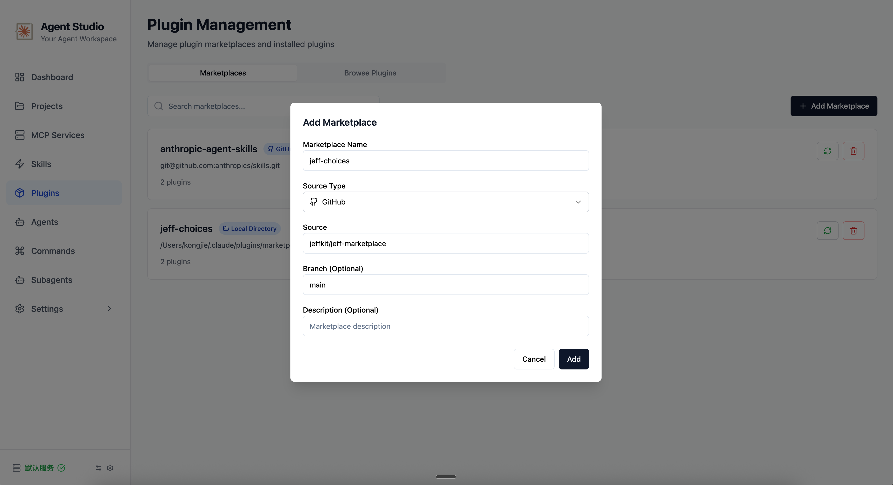

# Jeff Marketplace

[中文文档](README_CN.md)

A collection of plugins for Jeff's workflow, designed to enhance Claude Code with personal assistance and autonomous development capabilities.


## Installation with Agent Studio

[Agent Studio](https://github.com/okguitar/agentstudio)



## Installation with Claude Code CLI

### Quick Install

1. **Start Claude Code CLI**:
   ```bash
   claude
   ```

2. **Add this marketplace**:
   ```bash
   /plugin marketplace add https://github.com/jeffkit/jeff-marketplace.git
   ```

3. **Install plugins**:
   ```bash
   # Install the Assistant plugin for personal productivity
   /plugin install assistant@jeff-choices

   # Install the Speckit Driver plugin for autonomous development
   /plugin install speckit-driver@jeff-choices

   # Browse available plugins and install interactively
   /plugin

   ```

### Usage Examples

After installation, you can use the plugins directly in your Claude conversations:

```bash
# Assistant plugin usage
"Help me record to complete the project report, high priority, due this Friday"

"Show me my TODO items"

"Write a journal entry about today's learning"

# Speckit Driver plugin usage
"Use speckit to develop a user login feature"

"Build an API service using speckit"
```

## Plugins

### 1. Assistant

**Version:** 2.2.0
**Description:** Personal assistant for managing TODOs and journal entries, supporting task tracking, activity logging, and smart querying through natural conversation. Enhanced with project-oriented features for better task organization.

#### Skills

- **assistant**: The core skill that transforms Claude into a personal assistant.
    - **Capabilities**:
        - **Enhanced TODO Management**: Track tasks with priority, category, status, due dates, project, assignee, tags, and description.
        - **Journal Management**: Record daily activities with mood and tags.
        - **Interactive Clarification**: Asks questions to ensure data accuracy.
        - **Smart Querying**: Filter and search tasks and journals by multiple dimensions.
        - **Project-Oriented**: Organize tasks by project, assign to people, and tag for better management.
    - **Triggers**: "记录一下" (Record this), "添加TODO" (Add TODO), "写个日志" (Write a journal), "查看我的任务" (Check my tasks).
    - **Data Storage**: All data is stored in `.assistant/` directory (automatically created).

#### Migration from v2.0.x

If you're upgrading from a previous version that stored data in the project root, use the migration script:

```bash
python3 assistant/skills/assistant/scripts/migrate_data.py
```

This will move your `todos.json` and `journals.json` files to `.assistant/` directory.

---

### 2. Speckit Driver

**Version:** 1.1.1  
**Description:** Autonomous Spec-Driven Development orchestrator that enables intelligent, continuous workflow execution with minimal user intervention.

#### Skills

- **speckit-driver**: The main orchestrator skill that manages the entire development workflow. It coordinates sub-agents to execute tasks from constitution to implementation.

#### Agents

This plugin utilizes a suite of specialized sub-agents:

- **speckit-constitution**: Creates and manages project principles and governance.
- **speckit-specify**: Converts feature descriptions into detailed specifications.
- **speckit-clarify**: Identifies ambiguities in specifications and asks targeted questions.
- **speckit-checklist**: Generates quality checklists and "unit tests for requirements".
- **speckit-plan**: Generates technical implementation plans and researches technology decisions.
- **speckit-tasks**: Breaks down plans into actionable tasks and user stories.
- **speckit-analyze**: Performs cross-artifact consistency analysis (spec/plan/tasks) to ensure alignment.
- **speckit-implement**: Executes the implementation phase, monitoring progress and handling errors.
