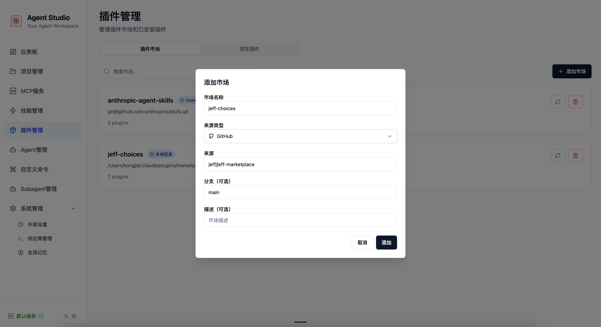

# Jeff Marketplace


[English Documentation](README.md)

Jeff 工作流的插件集合，旨在通过个人助手和自主开发能力增强 Claude Code。


## 使用 Agent Studio 安装

[Agent Studio](https://github.com/okguitar/agentstudio)



## 使用 Claude Code CLI 安装

### 快速安装

1. **启动 Claude Code CLI**:
   ```bash
   claude
   ```

2. **添加此市场源**:
   ```bash
   /plugin marketplace add https://github.com/jeffkit/jeff-marketplace.git
   ```

3. **安装插件**:
   ```bash
   # 安装 Assistant 插件用于个人生产力
   /plugin install assistant@jeff-choices

   # 安装 Speckit Driver 插件用于自主开发
   /plugin install speckit-driver@jeff-choices

   # 安装 Nano-PPT 插件用于 AI 驱动的演示文稿创建
   /plugin install nano-ppt@jeff-choices

   # 浏览所有插件或进行互动式安装
   /plugin
   ```

### 使用示例

安装后，您可以直接在 Claude 对话中使用这些插件：

```bash
# Assistant 插件使用
"帮我记录要完成项目报告，优先级高，这周五之前完成"

"看看我有哪些待办事项"

"写个日志记录今天的学习"

# Speckit Driver 插件使用
"用speckit开发一个用户登录功能"

"使用speckit构建一个API服务"

# Nano-PPT 插件使用
"创建一个关于季度业务成果的演示文稿"

"为项目提案制作一份PPT"

"生成团队会议用的幻灯片"
```

## 插件列表

### 1. Assistant (个人助手)

**版本:** 2.2.0
**描述:** 用于管理 TODO 和日志条目的个人助手，支持通过自然对话进行任务跟踪、活动记录和智能查询。

#### 技能 (Skills)

- **assistant**: 将 Claude 转变为个人助手的核心技能。
    - **功能**:
        - **TODO 管理**: 跟踪具有优先级、分类、状态和截止日期的任务。
        - **日志管理**: 记录带有心情和标签的日常活动。
        - **交互式澄清**: 提问以确保数据准确性。
        - **智能查询**: 筛选和搜索任务及日志。
    - **触发词**: "记录一下", "添加TODO", "写个日志", "查看我的任务"。
    - **数据存储**: 所有数据存储在 `.assistant/` 目录下（自动创建）。

#### 从 v2.0.x 版本迁移

如果你从之前在项目根目录存储数据的版本升级，请使用迁移脚本：

```bash
python3 assistant/skills/assistant/scripts/migrate_data.py
```

这将把你的 `todos.json` 和 `journals.json` 文件移动到 `.assistant/` 目录。

---

### 2. Speckit Driver (Speckit 驱动器)

**版本:** 1.1.1  
**描述:** 自主 Spec 驱动开发 (SDD) 编排器，能够以最少的用户干预实现智能、连续的工作流执行。

#### 技能 (Skills)

- **speckit-driver**: 主要的编排技能，管理整个开发工作流。它协调子 Agent 从宪法到实现执行各项任务。

#### 代理 (Agents)

该插件使用一套专门的子 Agent：

- **speckit-constitution**: 创建和管理项目原则与治理。
- **speckit-specify**: 将功能描述转换为详细的规范。
- **speckit-clarify**: 识别规范中的歧义并提出针对性问题。
- **speckit-checklist**: 生成质量检查清单和“需求单元测试”。
- **speckit-plan**: 生成技术实施计划并研究技术决策。
- **speckit-tasks**: 将计划分解为可执行的任务和用户故事。
- **speckit-analyze**: 执行跨工件一致性分析 (spec/plan/tasks) 以确保对齐。
- **speckit-implement**: 执行实施阶段，监控进度并处理错误。

---

### 3. Nano-PPT (AI 演示文稿生成器)

**版本:** 1.0.0
**描述:** 使用 Google Gemini AI 模型生成专业 PowerPoint 幻灯片的 AI 驱动演示文稿创建器。

#### 前置条件

使用此插件前，您需要进行以下设置：

- **Google GenAI API 密钥**: 设置 `GEMINI_API_KEY` 环境变量

```bash
# 设置您的 API 密钥
export GEMINI_API_KEY="your-google-ai-api-key"
```

**Python 依赖**: 插件会在需要时自动检查并安装所需的依赖包（`google-genai`、`Pillow`），无需手动安装。

#### 技能 (Skills)

- **nano-ppt**: 管理 4 阶段演示文稿创建工作流的主要编排器技能。
    - **功能**:
        - **需求收集**: 通过互动问答了解演示文稿需求
        - **结构化工作流**: 4 阶段流程（需求收集 → 简要大纲 → 详细大纲 → 幻灯片生成）
        - **视觉一致性**: 使用参考图像保持幻灯片间的风格统一
        - **用户审批门槛**: 每个阶段转换前需要用户批准
        - **顺序生成**: 按顺序创建幻灯片以确保连贯性
    - **触发词**: "Create a presentation", "Make a PowerPoint", "Generate slides", "创建PPT", "制作演示文稿"
    - **输出**: 生成的幻灯片保存到 `./ppt-output/[presentation-name]/` 目录

#### 代理 (Agents)

该插件使用一套专门的子代理：

- **nanoppt-requirements**: 通过对话访谈收集演示文稿需求。
- **nanoppt-brief-outline**: 创建带有标题、主要思想和过渡的高层级幻灯片结构。
- **nanoppt-detailed-outline**: 扩展为具有完整内容和视觉要求的就绪生产规范。
- **nanoppt-slide-generator**: 使用 Google Gemini AI 生成单独的幻灯片图像。

#### 工作流阶段

1. **需求收集**: 互动问答以了解演示文稿目标、受众和风格偏好
2. **简要大纲**: 带有叙事流程和关键信息的幻灯片高层级结构
3. **详细大纲**: 包含文本、视觉元素和样式要求的完整内容规范
4. **幻灯片生成**: 使用 Google Gemini 进行顺序图像生成，确保幻灯片间的视觉一致性
